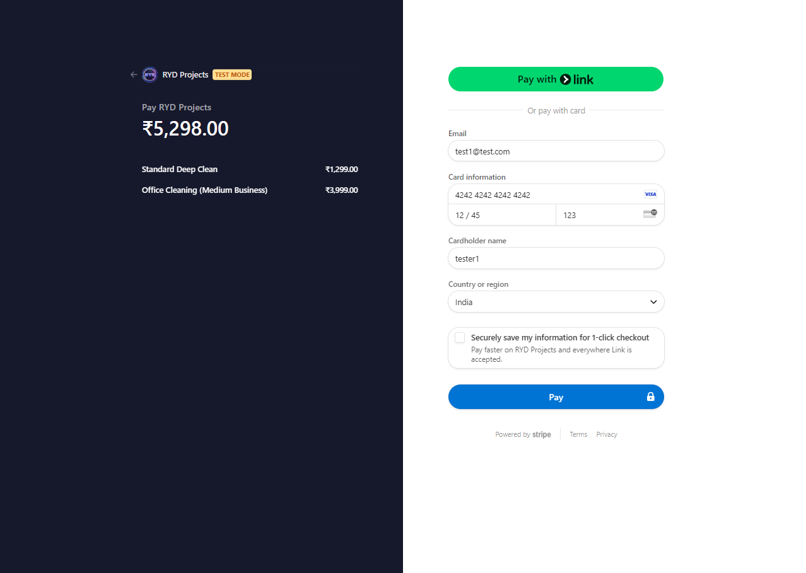
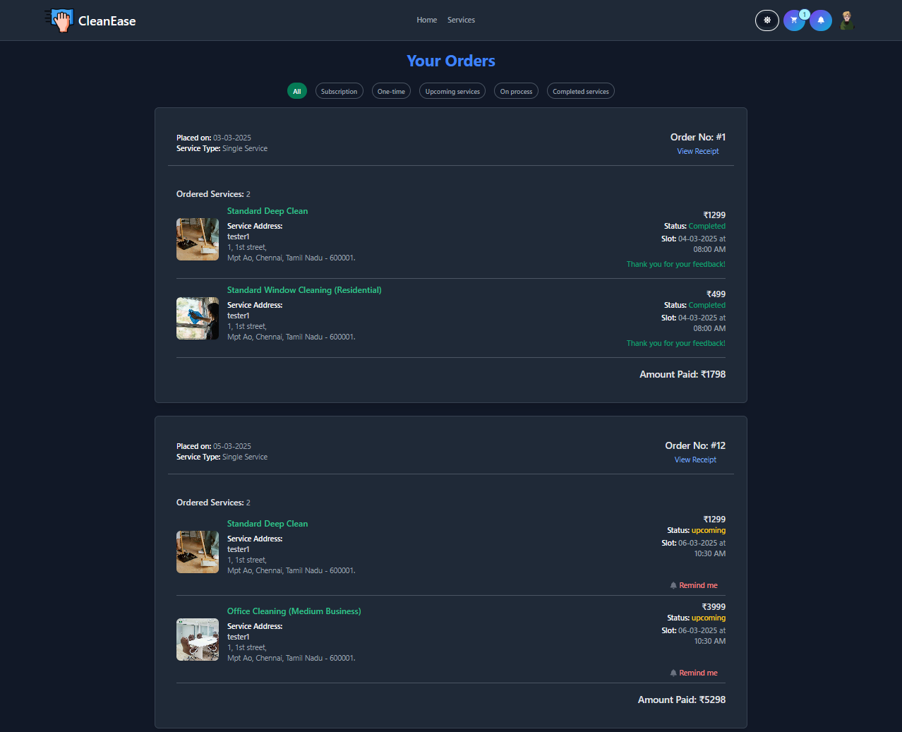

# <h1 align='center'> CleanEase - Frontend </h1>

CleanEase is a full-stack web application designed to streamline and enhance the booking of cleaning services. It provides an intuitive and responsive interface for users to explore, filter, and schedule cleaning services based on their preferences. The platform also includes secure payment processing, user authentication, and role-based access control.

---

## 🔍 Features

### 🎨 Frontend Features

- ✨ **User Authentication**: Login and registration using Firebase authentication.
- 🔄 **Dynamic UI**: Built with React for an interactive experience.
- ⚙️ **Filtering & Search**: Find services by availability, timing, and budget.
- 🏠 **Personalized Checklists**: Users can create and manage their own cleaning checklists.
- ⏳ **Booking System**: One-time and recurring appointments.
- 💳 **Secure Payments**: Integrated with Stripe for seamless transactions.
- 📲 **Reminders & Notifications**: Dashboard popups for upcoming appointments.
- 🌟 **Reviews & Ratings**: Users can leave feedback on services.

### 🛠️ Backend Features

- 🛠 **RESTful API**: Built with Node.js and Express.js.
- 📚 **Database Management**: MongoDB for storing user data, services, and orders.
- 🔒 **Security**: JWT authentication & Bcrypt password hashing.
- 🔐 **Role-Based Access**: Admin and user access control.
- ✅ **Order Management**: Admins can view, manage, and update service bookings.

---

## 🌐 Technologies Used

### 💻 Frontend

- ✨ **React.js**
- 👉 Redux Toolkit (State Management)
- 🔍 React Router Dom (Client-side Routing)
- 🎨 Flowbite React (UI Components)
- 🖌️ Tailwind CSS (Styling)
- 📜 Formik & Yup (Form Validation)
- 💳 Stripe API (Payment Processing)
- 🛠 Firebase (User Authentication)
- 🎉 React Toastify (Notifications)

### 🚀 Backend

- 🌟 Node.js
- 🛠 Express.js
- 📚 MongoDB (Mongoose ODM)
- 🔐 JSON Web Token (JWT) Authentication
- 🔑 Bcrypt (Password Hashing)
- 💳 Stripe (Payment Integration)

---

## 📸 Screenshots

### 👤 User Pages

<div align='center'>

<table>
  <tr>
<td>
    <figure>
      
      <br>
      <p align="center"><b>Home Page</b></p>
    </figure>
  </td>
  <td>
    <figure>
      
      <br>
      <p align="center"><b>Sign In</b></p>
    </figure>
  </td>
  <td>
    <figure>
      
      <br>
      <p align="center"><b>Sign Up</b></p>
    </figure>
  </td>
  </tr>
  <tr>
   <td>
    <figure>
      <a href="public/screenshots/User/google-signin.png">
        
      </a>
      <br>
      <p align="center"><b>Google Sign In</b></p>
    </figure>
  </td>
  <td>
    <figure>
      <a href="public/screenshots/User/user-profile.png">
        
      </a>
      <br>
      <p align="center"><b>User Profile</b></p>
    </figure>
  </td>
  <td>
    <figure>
      <a href="public/screenshots/User/user-address.png">
        
      </a>
      <br>
      <p align="center"><b>User Address</b></p>
    </figure>
  </td>
  </tr>
  <tr>
     <td>
    <figure>
      <a href="public/screenshots/User/services.png">
        
      </a>
      <br>
      <p align="center"><b>Services Page</b></p>
    </figure>
  </td>
  <td>
    <figure>
      <a href="public/screenshots/User/service-details.png">
        
      </a>
      <br>
      <p align="center"><b>Service Details</b></p>
    </figure>
  </td>
  <td>
    <figure>
      <a href="public/screenshots/User/cart.png">
        
      </a>
      <br>
      <p align="center"><b>Cart Page</b></p>
    </figure>
  </td>
  </tr>
  <tr>
   <td>
    <figure>
      <a href="public/screenshots/User/checkout-address.png">
        
      </a>
      <br>
      <p align="center"><b>Checkout Address</b></p>
    </figure>
  </td>
  <td>
    <figure>
      <a href="public/screenshots/User/checkout-slot.png">
        
      </a>
      <br>
      <p align="center"><b>Checkout Slot</b></p>
    </figure>
  </td>
  <td>
    <figure>
      <a href="public/screenshots/User/checkout-summary.png">
        
      </a>
      <br>
      <p align="center"><b>Checkout Summary</b></p>
    </figure>
  </td>
  </tr>
  <tr>
  <td>
    <figure>
      <a href="public/screenshots/User/payment.png">
        
      </a>
      <br>
      <p align="center"><b>Payment</b></p>
    </figure>
  </td>
  <td>
    <figure>
      <a href="public/screenshots/User/payment-success.png">
        
      </a>
      <br>
      <p align="center"><b>Payment Success</b></p>
    </figure>
  </td>
  <td>
    <figure>
      <a href="public/screenshots/User/payment-failed.png">
        
      </a>
      <br>
      <p align="center"><b>Payment Failed</b></p>
    </figure>
  </td>
  </tr>
  <tr>
     <td>
    <figure>
      <a href="public/screenshots/User/orders.png">
        
      </a>
      <br>
      <p align="center"><b>Orders</b></p>
    </figure>
  </td>
  </tr>
  </table>
  </div>

### 🚧 Error Page

  <div align='center'>
<table>
  <tr>
    <td>
    <figure>
      <a href="public/screenshots/page-not-found.png">
        
      </a>
      <br>
      <p align="center"><b>Page Not Found</b></p>
    </figure>
  </td>
  </tr>
</table>
</div>

### 🛠 Admin Panel

  <div align='center'>
<table>
  <tr>
 <td>
    <figure>
      <a href="public/screenshots/Admin/admin-dashboard.png">
        
      </a>
      <br>
      <p align="center"><b>Admin Dashboard</b></p>
    </figure>
  </td>
  <td>
    <figure>
      <a href="public/screenshots/Admin/admin-users.png">
        
      </a>
      <br>
      <p align="center"><b>Admin Users</b></p>
    </figure>
  </td>
  <td>
    <figure>
      <a href="public/screenshots/Admin/admin-transactions.png">
        
      </a>
      <br>
      <p align="center"><b>Admin Transactions</b></p>
    </figure>
  </td>
  </tr>
  <tr>
 <td>
    <figure>
      <a href="public/screenshots/Admin/admin-orders.png">
        
      </a>
      <br>
      <p align="center"><b>Admin Orders</b></p>
    </figure>
  </td>
  <td>
    <figure>
      <a href="public/screenshots/Admin/admin-reviews.png">
        
      </a>
      <br>
      <p align="center"><b>Admin Reviews</b></p>
    </figure>
  </td>
  <td>
    <figure>
      <a href="public/screenshots/Admin/admin-services.png">
        
      </a>
      <br>
      <p align="center"><b>Admin Services</b></p>
    </figure>
  </td>
  </tr>
 
</table>
</div>

---

## 🛠️ Getting Started

### ⚡ Prerequisites

Ensure you have the following installed:

- 💻 **Node.js** (LTS Version)
- 📂 **MongoDB** (Locally or Atlas)
- 🐳 **Git**

### ⏳ Installation

#### 📚 Clone the Repositories

```bash
# Frontend
git clone https://github.com/Yogadeepan29/CAPSTONE--CleanEase_Frontend.git

# Backend
git clone https://github.com/Yogadeepan29/CAPSTONE--CleanEase_Backend.git
```

#### 🚀 Frontend Setup

```bash
cd CleanEase-frontend
npm install
npm run dev
```

#### 🚀 Backend Setup

```bash
cd CleanEase-backend
npm install
npm start
```

---

## File Structure

### Frontend

```
CAPSTONE-CleanEase-(FRONTEND)/
├── 📜 .env
├── 🚫 .gitignore
├── 📂 dist/
├── ⚙️ eslint.config.js
├── 📝 index.html
├── 🌍 netlify.toml
├── 📜 package-lock.json
├── 📜 package.json
├── 🎨 postcss.config.js
├── 📂 public/
├── 📖 README.md
├── 📂 src/
│   ├── 🔧 apiConfig.js
│   ├── 🎨 App.css
│   ├── ⚛️ App.jsx
│   ├── 📁 Components/
│   │   ├── 🏗️ AddServiceModal.jsx
│   │   ├── 🖥️ AdminLayout.jsx
│   │   ├── 📊 AdminSidebar.jsx
│   │   ├── ⭐ CustomerReviews.jsx
│   │   ├── 🏠 DashboardAddress.jsx
│   │   ├── 👤 DashboardProfile.jsx
│   │   ├── 📊 DashboardSidebar.jsx
│   │   ├── ✏️ EditServiceModal.jsx
│   │   ├── 🔍 Filter.jsx
│   │   ├── 🚀 Footer.jsx
│   │   ├── 🏠 Header.jsx
│   │   ├── 🔑 OAuth.jsx
│   │   ├── 🔒 OnlyAdminPrivateRoute.jsx
│   │   ├── 🔒 PrivateRoute.jsx
│   │   ├── 🎨 ThemeProvider.jsx
│   ├── 🔥 firebase.js
│   ├── 🎨 index.css
│   ├── ⚛️ main.jsx
│   ├── 📁 Pages/
│   │   ├── 🛠️ Admin/
│   │   │   ├── 📊 AdminDashboard.jsx
│   │   │   ├── 📋 AdminOrders.jsx
│   │   │   ├── ⭐ AdminReviews.jsx
│   │   │   ├── 🛠️ AdminServices.jsx
│   │   │   ├── 💰 AdminTransaction.jsx
│   │   │   ├── 👥 AdminUsers.jsx
│   │   ├── 🚧 Common/
│   │   │   ├── ⚠️ PageNotFound.jsx
│   │   ├── 👤 User/
│   │   │   ├── ❌ Cancel.jsx
│   │   │   ├── 🛒 Cart.jsx
│   │   │   ├── 📦 CheckoutAddress.jsx
│   │   │   ├── ⏳ CheckoutSlot.jsx
│   │   │   ├── 📜 CheckoutSummary.jsx
│   │   │   ├── 🏠 Home.jsx
│   │   │   ├── 📦 Order.jsx
│   │   │   ├── 🧼 ServiceDetails.jsx
│   │   │   ├── 🛠️ Services.jsx
│   │   │   ├── 🔑 Signin.jsx
│   │   │   ├── 🆕 Signup.jsx
│   │   │   ├── ✅ Success.jsx
│   │   │   ├── 🏠 UserDashboard.jsx
│   ├── 🎯 Redux/
│   │   ├── ⚡ Slice/
│   │   │   ├── 🛒 cartSlice.jsx
│   │   │   ├── 📦 orderSlice.jsx
│   │   │   ├── 🛠️ servicesSlice.jsx
│   │   │   ├── 🎨 themeSlice.jsx
│   │   │   ├── 👤 userSlice.jsx
│   │   ├── 🗄️ Store.jsx
├── 🎨 tailwind.config.js
├── ⚡ vite.config.js

```

## 🏷️ Deployment

- **Frontend:** Deployed on Netlify → [Live Demo](https://ryd-cleanease.netlify.app/)
- **Backend:** Deployed on Render → [API](https://capstone-cleanease-backend.onrender.com)

---

## 🧪 Testing Information

### 🎭 Demo User Credentials

- **User Login**

  - Email: `test1@test.com`
  - Password: `qwerty`

  - **Admin Login**
  - Email: `admin@admin.com`
  - Password: `qwerty@123`

### 💳 Stripe Test Card Details

Use the following test card details for payment:

- **Card Number**: `4242 4242 4242 4242`
- **Expiry Date**: `12/34`
- **CVC**: `123`
- **ZIP Code**: Any 5-digit number

---

## 👤 Author

**YOGADEEPAN.R**

---
